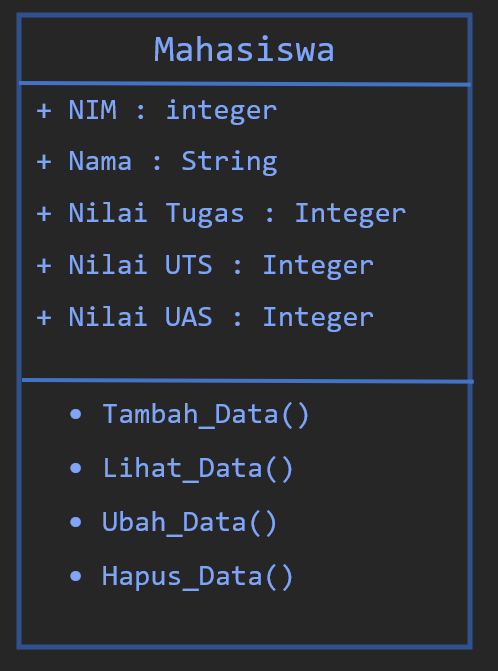

# Latihan OOP di bahasa python                

* Nama          : Johan Putra Pradana             
* NIM           : 312110314              
* Kelas         : TI.21.C1              
* Mata Kuliah   : Bahasa Pemrograman                 
----------------------------------                     
Dalam latihan dasar OOP [`python`](https://www.python.org/) ini, saya menggunakan [`Visual Studio Code`](https://code.visualstudio.com/) sebagai teks editornya.               

Buat program sederhana dengan mengaplikasikan penggunaan `class`. Buatlah `class` untuk menampilkan daftar nilai mahasiswa, dengan ketentuan:                

* Method `tambah()` untuk menambah data                
* Method `tampilkan()` untuk menampilkan data                
* Method `hapus(nama)` untuk menghapus data berdasarkan nama                
* Method `ubah(nama)` untuk mengubah data berdasarkan nama               
  
          

Pertama kita mendeklarasikan sebuah `class` Mahasiswa yang didalamnya terdapat `atribut` NIM, Nama, nilai tugas, nilai UTS dan nilai UAS.           

```bash
class mahasiswa:
    def __init__(self, nim, nama, tugas, uts, uas):
        self.nim = nim
        self.nama = nama
        self.tugas = tugas
        self.uts = uts
        self.uas = uas
```                  

> Jangan lupa, untuk mendeklarasikan sebuah class didalam OOP kita harus gunakan `def__init__` dan juga `self`           

Seperti biasa, deklarasikan satu dictionary kosong sebagai tempat menyimpan data-data yang sudah kita input. Ada 5 list kosong yang nanti isinya yaitu NIM, Nama, nilai tugas, nilai UTS dan nilai UAS.           

```bash
data = mahasiswa([],[],[],[],[])
```
Kita akan buat beberapa `method` untuk menambahkan, menampilkan, menghapus, mengubah data mahasiswa.         
Pertama membuat method `tambah()`, method ini berfungsi untuk menambahkan data. Dalam method ini kita menggunakan `append()` supaya data yang terakhir ditambahkan, ada di urutan list paling akhir.             

```bash
def tambah(self,nim,nama,tugas,uts,uas):
    data.nim.append(nim)
    data.nama.append(nama)
    data.tugas.append(tugas)
    data.uts.append(uts)
    data.uas.append(uas)
```            
Ini tampilan jika kita memanggil method `tambah()` :                 
          

Membuat method `lihat()`, gunanya untuk menampilkan seluruh data yang sudah kita tambahkan tadi. Kalau tidak ada data sama sekali, maka akan muncul tulisan **TIDAK ADA DATA**. Kita menggunakan `for loop` untuk menampilkan banyaknya data. Nantinya data akan ditampilkan sebanyak n kali.               

```bash
def lihat(self):
     for i in range(len(data.nama)):
         print("|", i+1, "  |", end="")
         print('{0:<25}'.format(self.nama[i]), end="")
         print("|", self.nim[i], end="")
         print(" |", self.tugas[i], end="")
         print("    |", self.uts[i], end="")
         print("  |", self.uas[i], " | ", end="")
         print(f'{((self.tugas[i]*30/100) + (self.uts[i]*35/100) + (self.uas[i]*35/100)) :.2f}', " |")
```               
Ini tampilan jika kita memanggil method `lihat()` :                 
          

Membuat method `ubah()` yang fungsinya untuk mengubah data. jika method ini dipanggil, maka data Nama, NIM, nilai tugas, nilai UTS, nilai UAS index nomor - `(no)` akan diubah sesuai dengan inputan dari user. Index ke - `(no)` akan dicari secara otomatis sesuai dengan nama yang ingin diubah oleh user.                

```bash
def ubah(self,nim,nama,tugas,uts,uas):
     self.nim[no] = nim
     self.nama[no] = nama
     self.tugas[no] = tugas
     self.uts[no] = uts
     self.uas[no] = uas
```                         
Ini tampilan jika kita memanggil method `ubah()` :                 
           
           

Terakhir kita buat method `hapus()`. Gunanya adalah menghapus data berdasarkan nama. Kita bisa menggunakan `del` untuk menghapus datanya. Seperti tadi, nomor index list yang akan dihapus disesuaikan dengan inputan dari user. Yaitu index nomor ke - `(no)`.                  

```bash
def hapus(self):
     del self.nim[no]
     del self.nama[no]
     del self.tugas[no]
     del self.uts[no]
     del self.uas[no]
```                               
Ini tampilan jika kita memanggil method `hapus()` :                 
            

Kita sudah mendeklarasikan class, instance class dan juga methods. Sekarang semua itu bisa dilihat dengan diagram seperti ini :               
              

Dan untuk menjalankan program dan bisa memanggil masing-masing methods, seperti biasa kita menggunakan `while loop` yang didalamnya ada `conditional` seperti ini.             

```bash
while True:
    menu = input("\n[(L)ihat, (T)ambah, (U)bah, (H)apus, (K)eluar]:")
    if menu == "t" or menu == "T":
       print("\nTambah Data")
       data.tambah(
           input("Masukkan NIM : "), 
           input("Masukkan Nama : "), 
           int(input("Nilai Tugas : ")), 
           int(input("Nilai UTS : ")), 
           int(input("Nilai UAS : "))
           )
       print("\nData berhasil ditambahkan")

    elif menu == "l" or menu == "L":
        print("\nDaftar Nilai")
        print("==========================================================================")
        print("| No  |          Nama           |    NIM    | TUGAS | UTS | UAS |  AKHIR |")
        print("==========================================================================")
        if len(data.nama) != 0:
            data.lihat()
        else:
            print("                         TIDAK ADA DATA                               ")
        print("==========================================================================")

    elif menu == "u" or menu == "U":
        print("\nUbah Data")
        ubah = input("Masukkan Nama : ")
        if ubah in data.nama:
           no = data.nama.index(ubah)
           print("Masukkan Data Yang Baru : ")
           data.ubah(
               input("NIM : "),
               input("Nama : "),
               int(input("Nilai Tugas : ")),
               int(input("Nilai UTS : ")),
               int(input("Nilai UAS : "))
               )
        else:
            print(ubah, "tidak ada di dalam data")

    elif menu == "h" or menu == "H":
        print("\nHapus Data")
        hapus = input("Masukkan Nama : ")
        if hapus in data.nama:
            no = data.nama.index(hapus)
            data.hapus()
            print("Data", hapus, "Berhasil dihapus")
        else:
            print(hapus, "tidak ada di dalam data")

    elif menu == "k" or menu == "K":
        print("\nTerimakasih\n")
        break

    else:
        print("\nPerintah yang dimasukkan salah!\n")
```                                 

Sekian terimakasih.